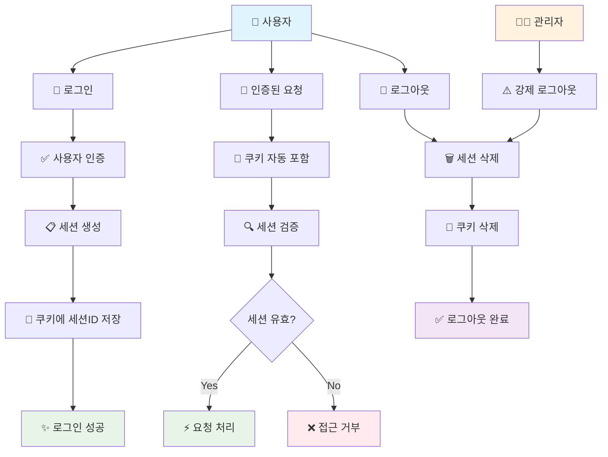
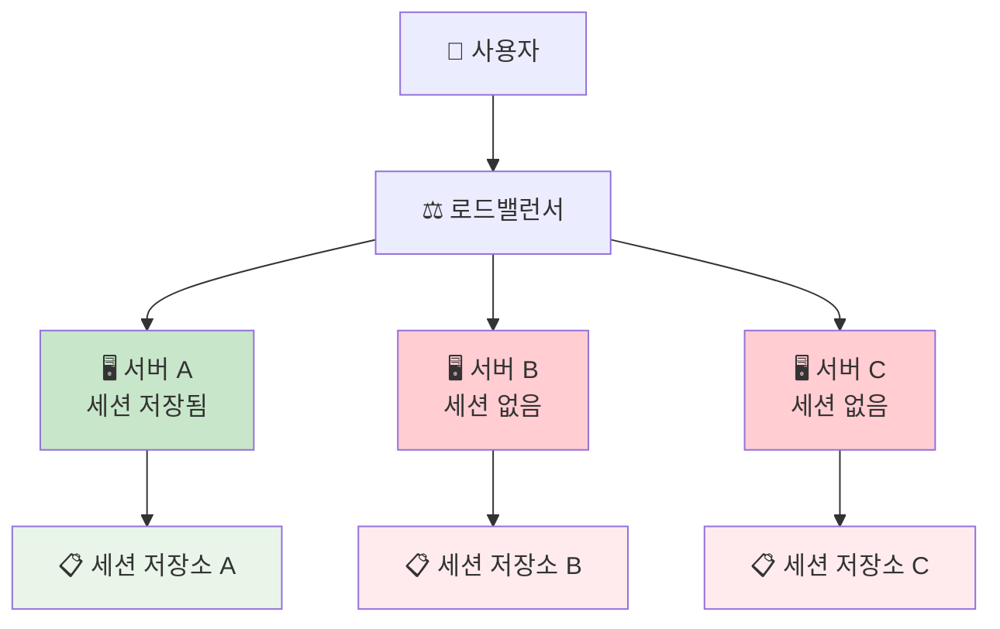
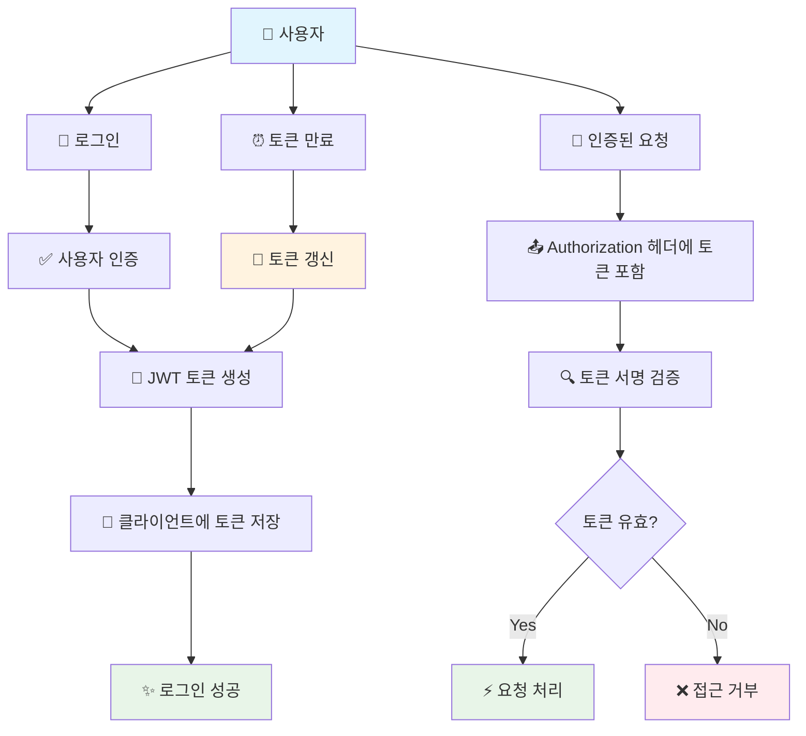
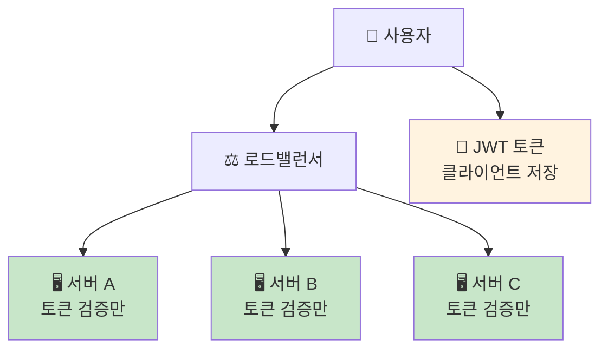

  <h1>What is Jwt?</h1>
  
이 저장소에서는 세션 기반 인증과 토큰 기반 인증의 차이점을 비교 분석하고, 
JWT의 구조와 동작 원리를 이해한 후, Spring Security를 활용한 실제 구현 방법과 
예외 처리, 리프레시 토큰까지 단계별로 학습하기 위한 저장소입니다.

## 목차
1. [**개요**](#1)
2. [**인증 방식 비교**](#2)
3. [**JWT란?**](#3)
4. [**스프링 시큐리티에서 토큰기반 인증 흐름**](#4)
5. [**JWT 예외 유형**](#5)
6. [**리프레시 토큰**](#6)

## 개요
대부분의 웹사이트에서는 로그인을 한 후 사용자가 로그인 한 상태가 유지된 채로 웹서비스를 이용합니다.  
이때 사용자의 **신원을 확인하고 서비스에 접근할 권한이 있는지 확인하는 인증/인가 과정**이 필요합니다.

전통적으로는 세션 기반 인증 방식을 사용했지만, 최근에는 토큰 기반 인증 방식이 널리 채택되고 있습니다. 특히 **JWT(JSON Web Token)** 는 웹 표준(RFC 7519)으로 정의된 안전하고 효율적인 인증/인가 솔루션입니다.

이 저장소에서는 세션 기반 인증과 토큰 기반 인증의 차이점을 비교 분석하고, 
JWT의 구조와 동작 원리를 이해한 후, Spring Security로 구현한 토큰 방식 인증 흐름과 
예외 처리, 리프레시 토큰까지 단계별로 정리해보려고 합니다.

## 인증 방식 비교
HTTP는 Stateless하기 때문에, 로그인 상태를 유지하려면 클라이언트가 매 요청마다 인증 정보를 함께 보내야 하며, 서버는 이 정보를 검증해서 사용자의 인증 여부를 판단해야 합니다.
이를 위해 일반적으로 **세션 기반 인증**또는 **토큰 기반 인증**이라는 두 가지 방식이 사용됩니다.

#### 세션 기반 인증
먼저, 세션 기반 인증은 사용자가 로그인하면 서버가 고유한 세션 ID를 생성하고, 이를 클라이언트의 쿠키에 저장해둡니다. 
이후 사용자가 요청을 보낼 때마다 이 세션 ID가 함께 전송되며, 서버는 해당 ID를 통해 저장된 세션 정보를 조회하여 사용자의 인증 상태를 확인합니다.

세션이 서버에 저장되기 때문에 **세션을 즉시 무효화** 시킬 수 있습니다. 로그아웃은 세션을 무효화 시키면 끝나고, 사용자가 해킹을 당했다거나
이상한 징후가 보이면 액세스를 제어할 수 있습니다. 
또한 보통 쿠키에 세션ID를 저장하고, 쿠키는 자동으로 포함되어 전송되기 때문에 클라이언트단의 구현이 쉽다는 장점이 있습니다.

반면에 세션 방식은 **확장성에 제한**이 있습니다. 
기본적으로 세션은 서버의 메모리(HttpSession)에 저장되기 때문에, 서버가 한 대일 경우에는 문제가 없지만, **서비스 규모가 커져 서버가 여러 대로 수평 확장되는** 경우 문제가 발생합니다.
서버 인스턴스가 3개이고 사용자가 A인스턴스에서 로그인 과정을 거쳤다고 가정해봅시다.

사용자가 로그인한 세션 정보가 A 서버의 메모리에만 저장되어 있다면, 다음 요청이 B 서버로 전달되었을 때 B 서버는 해당 세션 정보를 알 수 없어 인증 상태를 유지할 수 없습니다.

이러한 문제를 해결하기 위해, 서버 간 세션 정보를 일관되게 공유하거나 유지할 수 있는 방법이 필요합니다. 이를 해결하는 대표적인 방식은 다음과 같습니다.

#### 1. Sticky Session (고정 세션 방식)
**Sticky Session**은 로드밸런서가 특정 사용자의 요청을 항상 동일한 서버로 전달하도록 고정하는 방식입니다. 즉, 한 번 로그인한 사용자는 이후에도 계속 같은 서버로 요청을 보냅니다.

* 장점: 구현이 간단하고 별도의 세션 공유 구조 없이 문제를 해결할 수 있습니다.

* 단점: 특정 서버에 트래픽이 집중될 수 있고, 해당 서버가 다운되면 세션이 유실됩니다. 또한 로드밸런싱의 효과가 줄어듭니다.

#### 2. Session Clustering (세션 복제 방식)
**Session Clustering**은 각 서버 인스턴스가 자신에게 저장된 세션을 다른 서버들과 공유하거나 복제하는 방식입니다.

* All-to-All 방식: 모든 서버가 모든 세션 정보를 가지고 있는 방식입니다.

* Primary-Secondary 방식: 특정 서버(Primary)에 세션을 저장하고, 다른 서버(Secondary)와 일부 동기화합니다.

* 장점: 한 서버가 장애가 발생해도 세션 정보가 다른 서버에 있기 때문에 사용자는 로그아웃되지 않습니다.

* 단점: 서버가 많아질수록 세션 복제에 따른 네트워크 비용과 메모리 사용량이 증가합니다. 복제 간의 시간차로 인해 세션 불일치가 생길 수 있습니다.

#### 3. External Session Storage (외부 세션 저장소 사용)
이 방식은 세션 정보를 외부 저장소에 저장하고, 모든 서버가 이를 공유해서 사용하는 방식입니다.

* 관계형 데이터베이스 사용 (MySQL, PostgreSQL 등)

  * 장점: 영구적인 저장이 가능하며 안정성이 높습니다.

  * 단점: 디스크 기반 저장이므로 응답 속도가 느리고, 대규모 트래픽 처리에는 부적합할 수 있습니다.

* 인메모리 저장소 사용 (Redis, Memcached 등)

  * 장점: 메모리 기반이라 빠른 속도를 제공하며, TTL(Time-To-Live) 설정으로 세션 자동 만료도 가능합니다.

  * 단점: 기본적으로 메모리 기반이라, 적절한 영속성 설정(RDB, AOF)을 하지 않으면 서버 종료 시 데이터 유실 가능성이 있으며, 저장소가 단일 장애 지점(SPOF)이 될 수 있습니다. 이를 해결하기 위해 Redis Sentinel이나 클러스터 구성을 사용하는 것이 일반적입니다.

#### 토큰 기반 인증
토큰 기반 인증은 사용자가 로그인하면 서버가 **JWT(JSON Web Token) 등의 토큰을 생성**하여 클라이언트에게 전달하고, 클라이언트는 이 토큰을 저장해두었다가 이후 요청 시마다 HTTP 헤더에 포함하여 전송하는 방식입니다. 서버는 **토큰의 서명을 검증**하여 사용자의 인증 상태를 확인합니다.

토큰은 **Self-Contained** 방식으로 사용자 정보와 권한 정보를 토큰 자체에 포함하고 있어, 서버가 별도의 상태를 저장할 필요가 없는 **Stateless** 특성을 가집니다. 또한 토큰은 **디지털 서명**을 통해 위변조를 방지하며, 만료시간을 설정하여 보안성을 높일 수 있습니다

토큰 기반 인증의 가장 큰 장점은 **뛰어난 확장성**입니다. 토큰은 클라이언트에 저장되고 서버는 상태를 유지하지 않는 Stateless 특성을 가지고 있어, 서버 확장 시에도 별도의 복잡한 설정이 필요하지 않습니다.

기본적으로 토큰은 클라이언트(브라우저의 localStorage, sessionStorage 등)에 저장되기 때문에, 서버가 한 대든 여러 대든 상관없이 동작합니다. 예를 들어, 사용자가 로그인하여 받은 JWT 토큰을 가지고 있다면, 이 토큰은 A 서버든 B 서버든 어느 서버로 요청을 보내더라도 **토큰의 서명만 검증**하면 되므로 인증 상태를 유지할 수 있습니다.

세션 방식과 달리 매 요청마다 데이터베이스나 세션 저장소를 조회할 필요가 없어 **DB를 조회할 필요가 없습니다**. 따라서 성능상 이점이 있습니다.
또한 새로운 서버를 추가하더라도 세션 클러스터링이나 로드밸런싱 등의 복잡한 처리가 필요하지 않습니다.
또한 토큰은 웹, 모바일, 클라우드 등 다양한 플랫폼과 서비스에서 사용될 수 있으며, OAuth를 활용하면 소셜로그인 등의 기능도 쉽게 구현할 수 있습니다.

반면에 토큰은 **보안에 신경써야 합니다**. 만약 토큰이 제3자에 의해 탈취되면 제3자는 토큰 소유자인 척 행동할 수 있습니다. 세션과 달리 서버에서 즉시 무효화할 수 없어, **토큰 만료까지 대처하기 어렵다**는 문제가 있습니다. 때문에 토큰의 유효시간을 짧게 설정하거나, **Access Token과 Refresh Token을 분리**하여 사용하는 방식으로 보안을 강화해야 합니다.

또한 토큰은 사용자 정보를 포함하고 있어 **세션 ID에 비해 크기가 상대적으로 크며**, 클라이언트에서 토큰을 안전하게 저장하고 관리해야 하는 **추가적인 책임**이 발생합니다. XSS 공격 등에 취약할 수 있어 적절한 저장 방식(HttpOnly 쿠키, Secure 플래그 등)을 선택해야 합니다.

## JWT란?

## 스프링 시큐리티에서 토큰기반 인증 흐름

## JWT 예외 유형

## 리프레시 토큰
